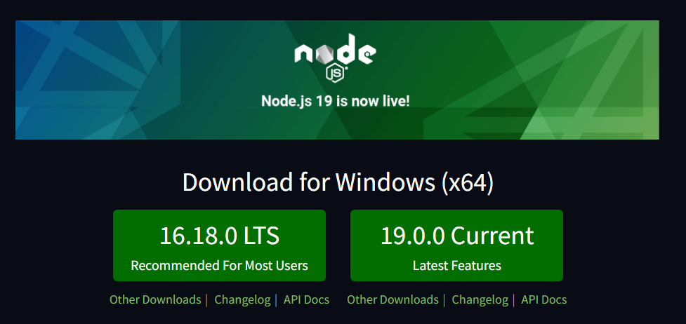
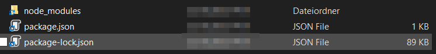
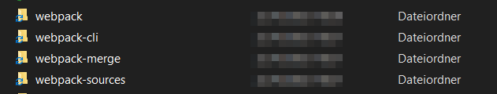

## Local Development Environment

### Node.js

Install / update Node.js to the latest version (16.18.0 in 10/2022).



After installarion check your node version using

```
node -v
```


### Init Project

```bash
npm init
```

This creates the file `package.json`.


### Firebase

#### Firebase Tools

Run 

```
firebase --version
```

If the command is not found or you get an upgrade hint, run

```
npm install -h firebase-tools
```

Note: You might get a warning due to outdated Node.js version. In this case update Node.js first.

Check (https://firebase.google.com/docs/cli#update-cli).


#### Install Firebase

```bash
npm install firebase@9.12.1
```

This creates the folder `node_modules` and updates the `package.json` file.



package.json

```json
{
  "dependencies": {
    "firebase": "^9.12.1"
  }
}
```

node-modules contains all files for firebase.

### Module Bundling (`webpack`)

https://firebase.google.com/docs/web/module-bundling

#### Install `webpack`

```
npm i webpack webpack-cli -D
```

This installs `webpack` in the node_modules folder.



The update package.json with the line in the `scripts` section

```
"build": "webpack --mode=development"
```

#### Add config.file

```javascript
const path = require('path');

module.exports = {
  // The entry point file described above
  entry: './index.js',
  
  output: {
    path: path.resolve(__dirname, 'dist'),
    filename: 'bundle.js'
  },
     
  // Optional and for development only. This provides the ability to
  // map the built code back to the original source format when debugging.
  devtool: 'eval-source-map',
};
```

##### Enable CSS Loading

Add this to the config-file

```
module: {
     rules: [
       {
         test: /\.css$/,
         use: ['style-loader', 'css-loader'],
       },
     ],
   },
```


## Demo App

### V9

https://firebase.google.com/docs/web/modular-upgrade

### Add Firebase UI

```
$ npm install firebaseui
```


## Project Hosting

Link for this chapter: https://firebase.google.com/docs/hosting/quickstart 

### Connect Project to Firebase Project

Run 

```
firebas init hosting
```

and answer the questions. Your lecturer will support you. This will create a file with name `firebase.json`

```json
{
  "hosting": {
    "public": "public",
    "ignore": [
      "firebase.json",
      "**/.*",
      "**/node_modules/**"
    ]
  }
}
```

### Deploy the project

```bash
firebase deploy --only hosting
```

